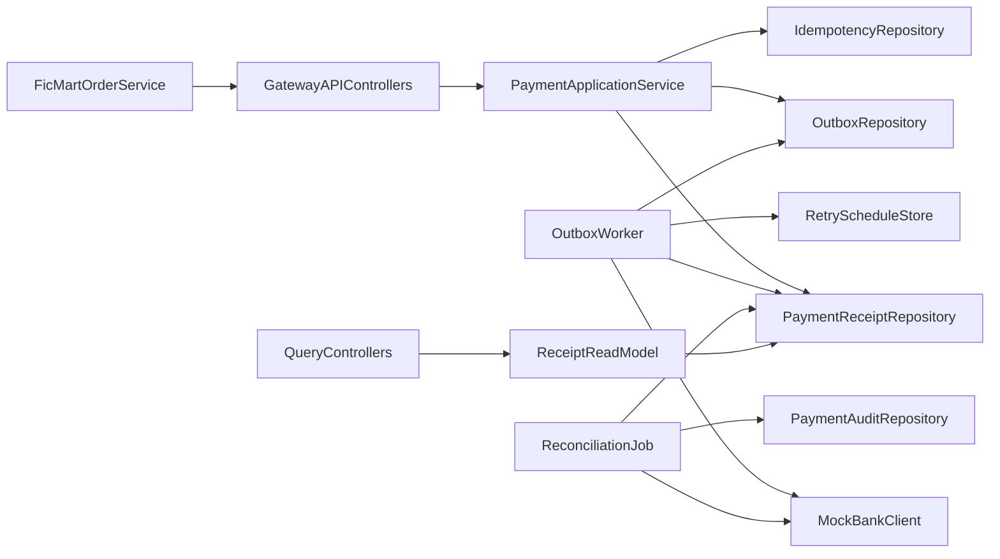

# Payment Gateway High-Level Architecture (Spring + Outbox)

## Goals

- Build a resilient gateway that never double-charges, never violates state transitions, and survives crashes between external calls and local persistence.
- Keep clear module boundaries (controller -> application service -> domain/persistence/integration).
- Make local receipt data the source of truth while continuously reconciling with bank state.

## Architecture Blueprint

## Module Boundaries (Spring)

- `payments.api`
  - HTTP controllers only: authorize/capture/void/refund/status-by-order/history-by-customer.
  - Header extraction (`Idempotency-Key`) and DTO validation.
- `payments.application`
  - Orchestrates use-cases and transaction boundaries.
  - Writes receipt + idempotency + outbox atomically.
- `payments.domain`
  - Payment aggregate/state machine and transition guards.
  - Domain errors (invalid transition, duplicate command with payload mismatch).
- `payments.infrastructure.persistence`
  - JPA repositories and schema mappings.
- `payments.infrastructure.bank`
  - Typed bank client + response/error mapping.
- `payments.infrastructure.jobs`
  - Outbox worker, retry scheduler, reconciliation job.
- `common`
  - Global exception filter, error envelope, logging abstractions, clock/UUID providers.

## Payment Lifecycle Model

- States: `PENDING -> AUTHORIZED -> CAPTURED -> REFUNDED` and `AUTHORIZED -> VOIDED`.
- Commands:
  - `Authorize(orderId, customerId, card, amount, currency, idemKey)`
  - `Capture(paymentRef, idemKey)`
  - `Void(paymentRef, idemKey)`
  - `Refund(paymentRef, idemKey)`
- Rule: state transition validated in domain before enqueueing bank request.
- Rule: gateway rejects invalid transitions even if bank would accept.

## Persistence Model (minimum tables)

- `payment_receipts`
  - `payment_ref` (PK), `order_id`, `customer_id`, `amount_cents`, `currency`, `state`, `version`
  - `authorized_at`, `captured_at`, `voided_at`, `refunded_at`
  - `bank_authorization_id`, `bank_capture_id`, `bank_void_id`, `bank_refund_id`
  - `last_error_code`, `last_error_message`, `created_at`, `updated_at`
- `idempotency_records`
  - `idempotency_key`, `operation`, `request_hash`, `status`, `response_snapshot`, `payment_ref`, timestamps
  - Unique index on `(operation, idempotency_key)`.
- `outbox_events`
  - `event_id`, `payment_ref`, `event_type`, `payload`, `status`, `attempt_count`, `next_attempt_at`, timestamps
- `payment_state_history` (audit/debug)
  - state changes with reason/source (`client_request`, `worker_callback`, `reconciliation`).

## Command Handling Pattern (Outbox-First)

1. Controller validates request + idem key.
2. In one DB transaction:
   - Resolve/create idempotency record.
   - Validate current state.
   - Persist receipt state intent (or pending command marker).
   - Insert outbox event.
3. Return `202 Accepted` (or `200 replayed` for idempotent replay) with `payment_ref` and current known state.
4. Worker executes bank call and updates receipt + idem response snapshot.

## Idempotency Strategy

- Same `operation + idempotency_key` + same payload hash: return original response snapshot.
- Same key with different payload hash: reject (`409 IdempotencyKeyConflict`).
- Store both pending and terminal responses so retries during in-flight requests are deterministic.

## Failure Handling & Retry Policy

- Retry only transient bank failures: HTTP 5xx, timeouts, network I/O.
- Do not retry business failures: invalid card, insufficient funds, invalid bank state.
- Retry policy: exponential backoff + jitter + max attempts + dead-letter status.
- Worker leases outbox rows (`SELECT ... FOR UPDATE SKIP LOCKED`) to allow horizontal scaling.

## Crash Recovery Guarantees

- If app crashes after writing outbox but before bank call: worker picks event later.
- If app crashes after bank success but before local commit:
  - Use bank idempotency key derived from gateway command id (`bank:{paymentRef}:{operation}:{attemptLogical}`) to make retries safe.
  - Reconciliation job detects mismatches and heals local receipt.

## Reconciliation Design

- Scheduled job scans receipts in non-final or suspicious states.
- Queries bank for authoritative operation status (or replays idempotent operation where API supports).
- Resolves divergences:
  - local pending + bank success -> mark local success
  - local success + bank missing -> raise manual review/audit alert
- Every correction logged to `payment_state_history`.

## External API Shape (Gateway)

- `POST /v1/payments/authorize`
- `POST /v1/payments/{paymentRef}/capture`
- `POST /v1/payments/{paymentRef}/void`
- `POST /v1/payments/{paymentRef}/refund`
- `GET /v1/payments/by-order/{orderId}`
- `GET /v1/payments/by-customer/{customerId}`
- All mutation endpoints require `Idempotency-Key` header.

## Error Contract

- Unified envelope: `{ code, message, details, correlationId }`.
- Map domain errors to 4xx; transient processing to `202`; terminal external/business failures to 4xx/422 as appropriate.
- Never leak raw stack traces or bank internals.

## Observability

- Structured logs with `paymentRef`, `orderId`, `customerId`, `idempotencyKey`, `bankRequestId`, `correlationId`.
- Metrics:
  - success/failure per operation
  - retries and dead-letter counts
  - reconciliation corrections
  - outbox lag/queue depth
- Trace HTTP request -> DB tx -> worker execution -> bank call.

## Suggested Initial Package Layout

- [src/main/java/com/paymentgateway/gateway](src/main/java/com/paymentgateway/gateway)
  - `payments/api`
  - `payments/application`
  - `payments/domain`
  - `payments/infrastructure/persistence`
  - `payments/infrastructure/bank`
  - `payments/infrastructure/jobs`
  - `common`

## Delivery Phases

1. Domain state machine + receipt persistence.
2. Idempotency record model + deterministic replay behavior.
3. Outbox + worker + transient retry engine.
4. Bank adapter integration + error mapping.
5. Query endpoints (order/customer) + audit history.
6. Reconciliation job + mismatch resolution policy.
7. Hardening: observability, load/failure tests, chaos validation against mock bank.
